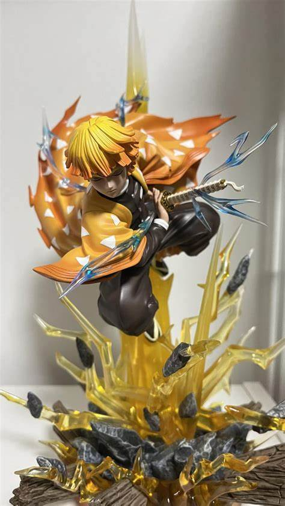
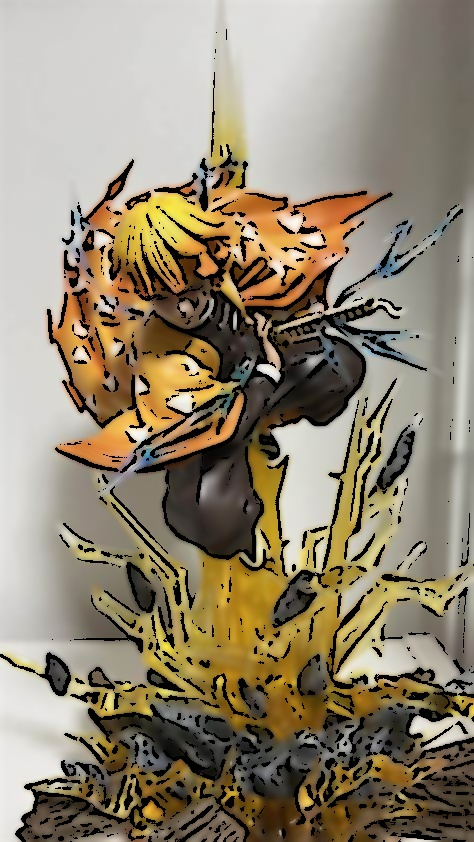

# 🖼️ Cartoonify with OpenCV

This simple program transforms images into cartoons-style images using OpenCV in Python.

---

## 📌 Features

- Grayscale conversion
- Median blur for noise reduction
- Adaptive threshold for edge detection
- Bilateral filter for smooth, colorful cartoon effect
- Edge-mask blending
- Output images saved to `output/` folder

---

## ▶️ Example

### 🔹 Input Image



### 🔸 Cartoonified Output



---

## 🛠️ Requirements

- Python 3.x
- OpenCV

Install dependencies:

```bash
pip install opencv-python
```

---

## 🚀 How to Use

```bash
python cartoonify.py
```

- Add your input images into the `input/` folder.
- The results will be saved in the `output/` folder automatically.

---

## 📌 Notes

- You can add more images to the `input/` folder and update the list in the script.
- Images will be processed and saved using the same filename format with a prefix.

---
